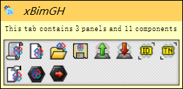

# xBIM GH

This is the grasshopper definition of [xBim](https://github.com/xBimTeam/XbimEssentials) to modify the IFC file in Grasshopper.

> [!WARNING]
>
> This plugin contains more than 1000 components! You need some **patience** to open your GH!

## Features

- Create/Open IFC
- Save IFC
- Find the data in IFC
- Modify the data in IFC

