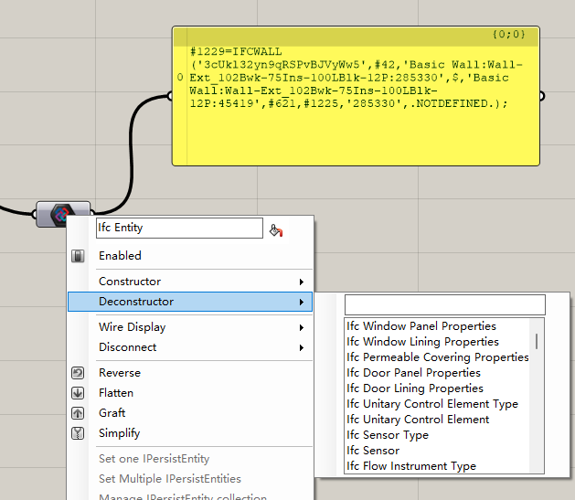
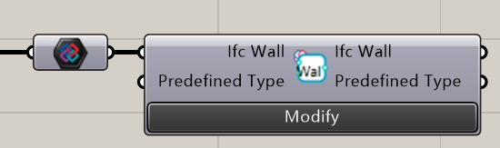
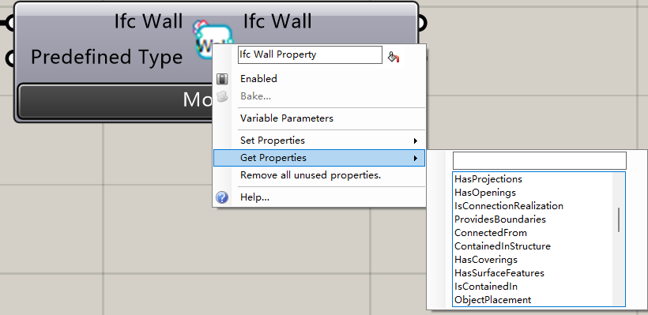
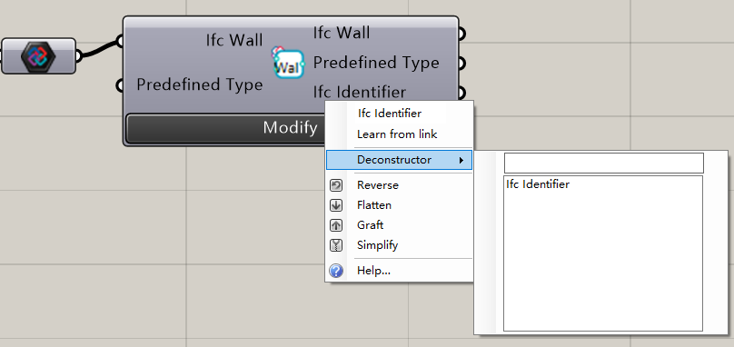
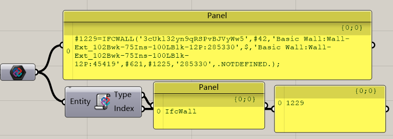

# Modify the Entity

The entity is the core thing for the Ifc modification. And there are more than 500 components designed for modifying the properties in the Ifc.

To make it looks easier to use, all of these components are hidden, And these components will be shown when needs.

## General Use

When you right click the parameter in the grasshopper which is an Ifc Entity, you'll get a list of the components that may be able to parse this data type. Find the right type you want to parse or just click the `Deconstructor` item. Then, you'll get one of the entity parse components.

Right click the icon to get all properties that can be set or get in this data type.

You can do this all the time.

If you want to modify the data in this add the new data to the input value, and click the button `Modify`.

## Entity Properties

### Input

| Name   | Data Type                                                    | Description     |
| ------ | ------------------------------------------------------------ | --------------- |
| Entity | [IPersistEntity](https://docs.xbim.net/XbimDocs/documentation/Xbim.Common/Xbim.Common.IPersistEntity.html) | The ifc Entity. |

#### Output

| Name  | Data Type | Description              |
| ----- | --------- | ------------------------ |
| Type  | String    | The Type Name            |
| Index | Int       | The index of the Entity. |

