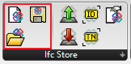
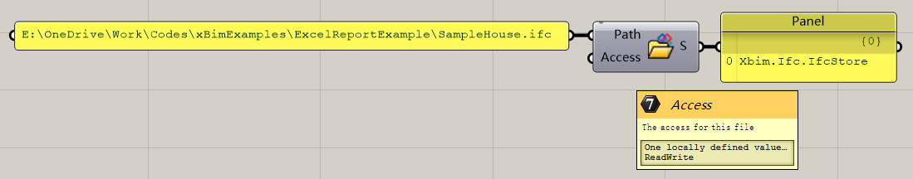
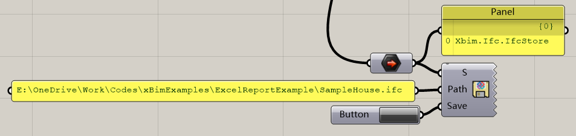
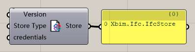

# IO

The ifc file in this plugin is called the `Ifc Store`. Ifc Store's modification is separated into two parts, `IO` and `Modify`. Here is the part of `IO`.

## Open

To make the ifc file can be modified in the Grasshopper, you need to open it in the grasshopper. So here is the component to open it.

### Input

| Name   | Data Type                                                    | Description                           |
| ------ | ------------------------------------------------------------ | ------------------------------------- |
| Path   | String                                                       | The path to this ifc in your machine. |
| Access | [XbimDBAccess](https://docs.xbim.net/XbimDocs/documentation/Xbim.Common/Xbim.IO.XbimDBAccess.html) | The accessfor this file.              |

### Output

| Name  | Data Type                                                    | Description    |
| ----- | ------------------------------------------------------------ | -------------- |
| Store | [IfcStore](https://docs.xbim.net/XbimDocs/documentation/Xbim.Ifc/Xbim.Ifc.IfcStore.html) | The ifc store. |

## Save

After modifying the ifc store, you can save it to your local path.

### Input

| Name  | Data Type                                                    | Description                          |
| ----- | ------------------------------------------------------------ | ------------------------------------ |
| Store | [IfcStore](https://docs.xbim.net/XbimDocs/documentation/Xbim.Ifc/Xbim.Ifc.IfcStore.html) | The Ifc store.                       |
| Path  | String                                                       | The path to the ifc in your machine. |
| Save  | Boolean                                                      | Set true to save this file.          |

## Create

A component to create a new Ifc Store

### Input

| Name        | Data Type                                                    | Description                  |
| ----------- | ------------------------------------------------------------ | ---------------------------- |
| Version     | [XbimSchemaVersion](https://docs.xbim.net/XbimDocs/documentation/Xbim.Common/Xbim.Common.Step21.XbimSchemaVersion.html) | The version to this ifc      |
| Store Type  | [XbimStoreType](https://docs.xbim.net/XbimDocs/documentation/Xbim.Common/Xbim.IO.XbimStoreType.html) | The store type to this ifc.  |
| Credentials | [XbimEditorCredentials](https://docs.xbim.net/XbimDocs/documentation/Xbim.Ifc/Xbim.Ifc.XbimEditorCredentials.html) | The Credentials of this ifc. |

### Output

| Name  | Data Type                                                    | Description    |
| ----- | ------------------------------------------------------------ | -------------- |
| Store | [IfcStore](https://docs.xbim.net/XbimDocs/documentation/Xbim.Ifc/Xbim.Ifc.IfcStore.html) | The ifc store. |