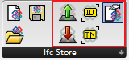
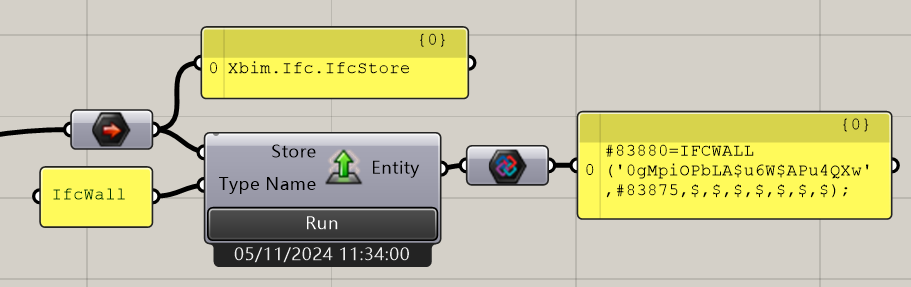
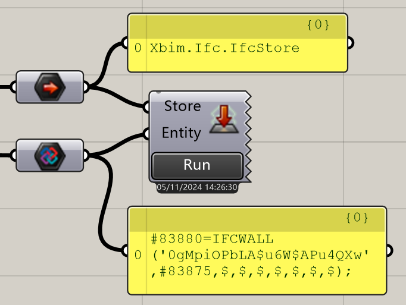
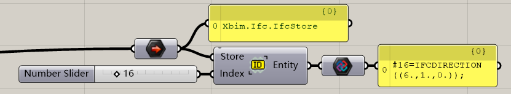
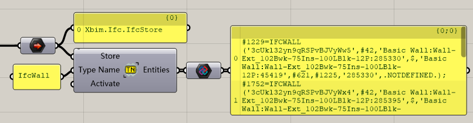
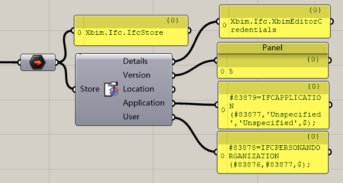

# Modify the Entity in Ifc Store

Entity is the one line of the Ifc Data. And this part is for getting, creating, and deleting an entity in the Grasshopper.

## Create Entity

Create an entity by the type name. Click run to create it.

### Input

| Name      | Data Type                                                    | Description                    |
| --------- | ------------------------------------------------------------ | ------------------------------ |
| Store     | [IfcStore](https://docs.xbim.net/XbimDocs/documentation/Xbim.Ifc/Xbim.Ifc.IfcStore.html) | The ifc store.                 |
| Type Name | String                                                       | The name of the type you want. |

### Output

| Name   | Data Type                                                    | Description |
| ------ | ------------------------------------------------------------ | ----------- |
| Entity | [IPersistEntity](https://docs.xbim.net/XbimDocs/documentation/Xbim.Common/Xbim.Common.IPersistEntity.html) | The entity. |

## Delete Entity

Delete one entity from a store.

### Input

| Name   | Data Type                                                    | Description    |
| ------ | ------------------------------------------------------------ | -------------- |
| Store  | [IfcStore](https://docs.xbim.net/XbimDocs/documentation/Xbim.Ifc/Xbim.Ifc.IfcStore.html) | The ifc store. |
| Entity | [IPersistEntity](https://docs.xbim.net/XbimDocs/documentation/Xbim.Common/Xbim.Common.IPersistEntity.html) | The entity.    |

## Get Entity By Index

Get the entity By the index of the entity.

### Input

| Name  | Data Type                                                    | Description             |
| ----- | ------------------------------------------------------------ | ----------------------- |
| Store | [IfcStore](https://docs.xbim.net/XbimDocs/documentation/Xbim.Ifc/Xbim.Ifc.IfcStore.html) | The ifc store.          |
| Index | Int                                                          | The index of the Entity |

### Output

| Name   | Data Type                                                    | Description |
| ------ | ------------------------------------------------------------ | ----------- |
| Entity | [IPersistEntity](https://docs.xbim.net/XbimDocs/documentation/Xbim.Common/Xbim.Common.IPersistEntity.html) | The entity. |

## Get Entity By Type Name

Get the Entities by the type name

### Input

| Name      | Data Type                                                    | Description                    |
| --------- | ------------------------------------------------------------ | ------------------------------ |
| Store     | [IfcStore](https://docs.xbim.net/XbimDocs/documentation/Xbim.Ifc/Xbim.Ifc.IfcStore.html) | The ifc store.                 |
| Type Name | String                                                       | The name of the type you want. |

### Output

| Name   | Data Type                                                    | Description |
| ------ | ------------------------------------------------------------ | ----------- |
| Entity | [IPersistEntity](https://docs.xbim.net/XbimDocs/documentation/Xbim.Common/Xbim.Common.IPersistEntity.html) | The entity. |

## Get The information of the Ifc Store

Get the basic information of a Ifc Store

### Input

| Name  | Data Type                                                    | Description    |
| ----- | ------------------------------------------------------------ | -------------- |
| Store | [IfcStore](https://docs.xbim.net/XbimDocs/documentation/Xbim.Ifc/Xbim.Ifc.IfcStore.html) | The ifc store. |

### Output

| Name        | Data Type                                                    | Description                   |
| ----------- | ------------------------------------------------------------ | ----------------------------- |
| Details     | [XbimEditorCredentials](https://docs.xbim.net/XbimDocs/documentation/Xbim.Ifc/Xbim.Ifc.XbimEditorCredentials.html) | details                       |
| Version     | [XbimSchemaVersion](https://docs.xbim.net/XbimDocs/documentation/Xbim.Common/Xbim.Common.Step21.XbimSchemaVersion.html) | The version of this ifc store |
| Location    | String                                                       | The location of this project  |
| Application | [IIfcApplication](https://docs.xbim.net/XbimDocs/documentation/Xbim.Ifc4/Xbim.Ifc4.Interfaces.IIfcApplication.html) | The application               |
| User        | [IIfcPersonAndOrganization](https://docs.xbim.net/XbimDocs/documentation/Xbim.Ifc4/Xbim.Ifc4.Interfaces.IIfcPersonAndOrganization.html) | The user                      |

